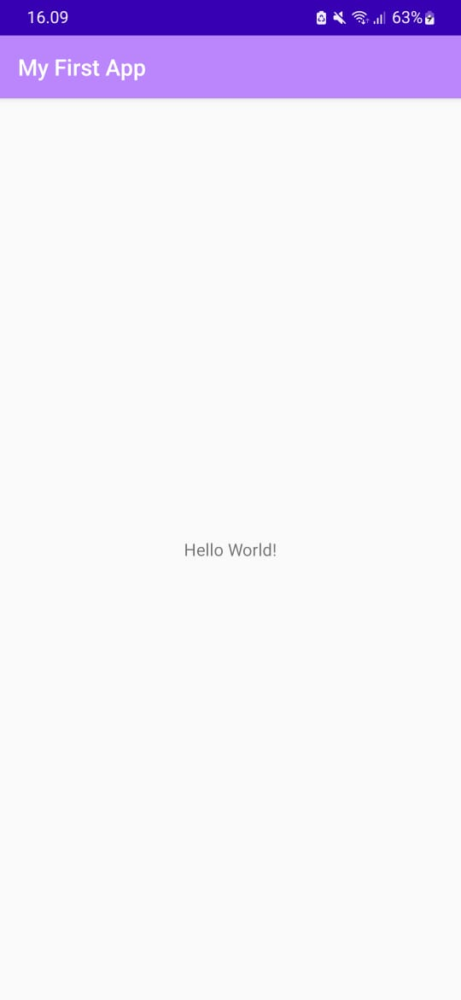

# Tugas 1 : Hello World Android Studio
    Nama  : Annisa Fitri Yuliandra
    Kelas : TI 3B
    Absen : 09
    NIM   : 2041720123
  Praktikum ini dilakukan dengan mengikuti petunjuk dari website : https://developer.android.com/training/basics/firstapp/index.html
## Membuat project Android
1. Instal Android Studio versi terbaru.
2. Di jendela Welcome to Android Studio, klik Create New Project.

3. Jika sudah membuka project, pilih File > New > New Project.

4. Di jendela Select a Project Template, pilih Empty Activity, lalu klik Next.
5. Di jendela Configure your project, lakukan langkah-langkah berikut:
6. Masukkan "My First App" pada kolom Name.
7. Masukkan "com.example.myfirstapp" pada kolom Package name.
8. Jika Anda ingin menempatkan project di folder lain, ubah lokasi Save-nya.
9. Pilih Java atau Kotlin dari menu drop-down Language.
10. Pilih Android versi terendah yang ingin didukung aplikasi Anda di kolom Minimum SDK.

11. Klik Finish.
12. Setelah beberapa waktu pemrosesan, jendela utama Android Studio akan muncul.

## Menjalankan aplikasi
1. Hubungkan perangkat Anda ke mesin pengembangan dengan kabel USB. Jika melakukan pengembangan di Windows, Anda mungkin perlu menginstal driver USB yang sesuai untuk perangkat Anda.
2. Lakukan langkah-langkah berikut untuk mengaktifkan proses debug USB di jendela Opsi developer:
  2.1 Buka aplikasi Setelan.
  2.2 Jika perangkat Anda menggunakan Android v8.0 atau lebih tinggi, pilih Sistem. Jika tidak, lanjutkan ke langkah berikutnya.
  2.3 Scroll ke bagian bawah, lalu pilih Tentang ponsel.
  2.4 Scroll ke bagian bawah, lalu ketuk Nomor build tujuh kali.
  2.5 Kembali ke layar sebelumnya, scroll ke bagian bawah, dan ketuk Opsi developer.
  2.6 Di jendela Opsi developer, scroll ke bawah untuk menemukan dan mengaktifkan proses debug USB.

3. Jalankan aplikasi di perangkat Anda sebagai berikut:
  3.1 Di Android Studio, pilih aplikasi Anda dari menu drop-down konfigurasi run/debug di toolbar.
  3.2 Di toolbar, pilih perangkat tempat Anda ingin menjalankan aplikasi dari menu drop-down perangkat target.
  3.3 Klik Run

## Hasil Praktikum
### Hello World (default)

    
### Hello World (Edited)

1. Mengganti My First App

2. Mengganti Hello World

